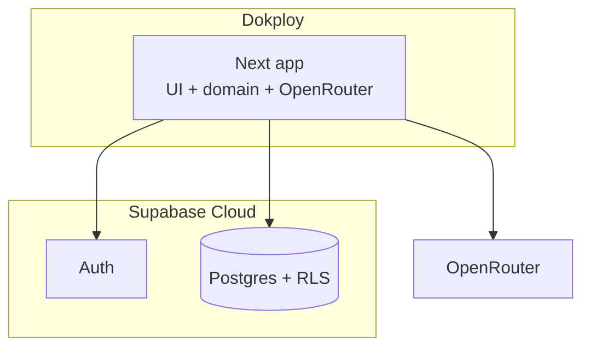
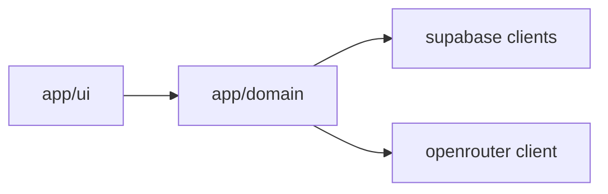
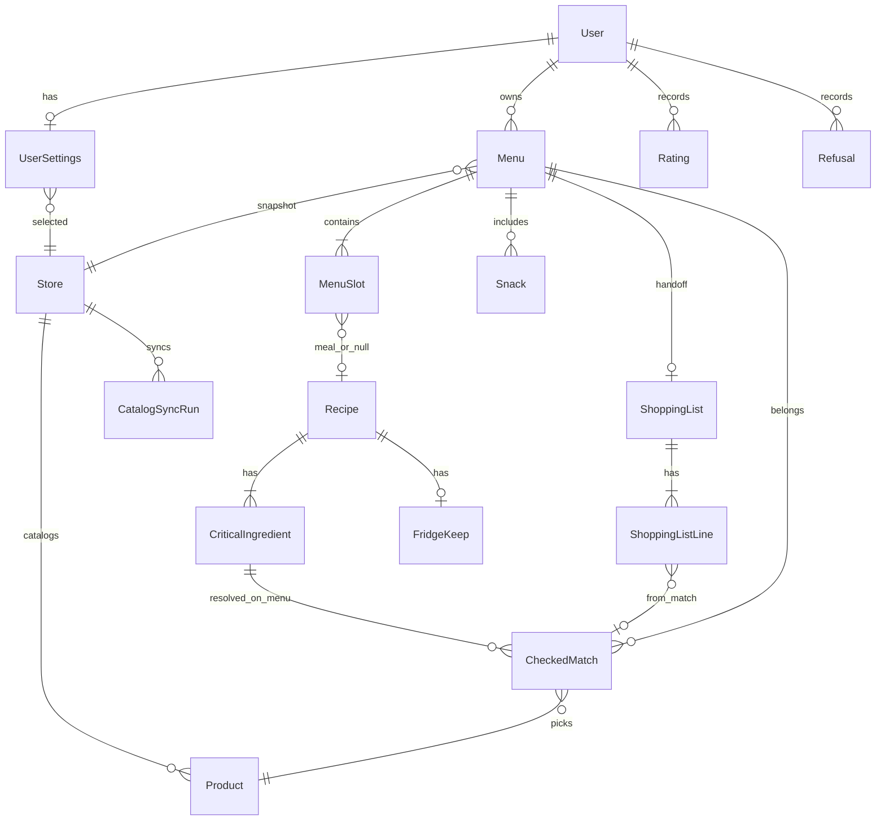

# Architecture Spine — keplo

## Design Paradigm

**BaaS-backed modular Next.** Domain orchestration (Menu, AI suggestions, ingredient Shopping list) lives in Next server modules. Persistence and Auth live in Supabase Cloud (Postgres + RLS). No live grocery catalog sync. UI is App Router + shadcn Soft Workshop / Lavender Workshop (UX-locked): desktop, Russian, light-only.



## Invariants & Rules

### AD-1 — Runtime topology [ADOPTED · revised 2026-07-20]

- **Binds:** all
- **Rule:** Deploy **Next** on **Dokploy**. Persist data and Auth in **Supabase Cloud**. No Python catalog-sync worker. Single **prod** (+ local Next against that Supabase project); Runtime: **Node.js ≥22** for Next.

### AD-2 — Catalog write ownership [SUPERSEDED 2026-07-20]

- **Superseded:** No live grocery catalog. Tables `stores`, `products`, `catalog_sync_runs` removed. Product intent lives only as recipe ingredient names.

### AD-3 — Matching & eligibility in Next [ADOPTED · revised 2026-07-20]

- **Binds:** fridge-keep, ai-suggestions
- **Rule:** Eligibility for suggest/assign is **fridge-keep** (`fridge_keep_days >= menu.day_count`) plus **Refusal/dislike** hard-suppress. No product/SKU matching.

### AD-4 — AI via OpenRouter from Next only [ADOPTED · revised 2026-07-20]

- **Binds:** FR-7, FR-8, FR-10, FR-12
- **Rule:** Recipe suggestions call **OpenRouter** from Next server code only. Model id is runtime config. Secrets never ship to the browser. AI may **invent** recipes and persist them to the shared library, then assign **only persisted ids**. **Refusal** and **dislike Rating** hard-suppress that Recipe/Snack from future suggestions (never bypassed by a second path).

### AD-5 — Auth & tenancy [ADOPTED]

- **Binds:** FR-23, personal data (Menu, Rating, history)
- **Rule:** Supabase Auth **email/password**. Next uses `@supabase/ssr` cookie sessions; protect planning routes with `getUser()`. RLS: user-owned rows require `auth.uid()`; shared recipe library is readable/writable by authenticated operators (invent path).

### AD-6 — Dependency & contract direction [ADOPTED · revised 2026-07-20]

- **Rule:** Allowed deps: UI → domain → Supabase / OpenRouter clients. **`supabase/migrations` is the schema SoT.** No sync worker.



### AD-7 — CheckedMatch canonical model [SUPERSEDED 2026-07-20]

- **Superseded:** `checked_matches` removed. Shopping list lines are ingredient names from `critical_ingredients` (+ free-text snacks).

### AD-8 — Catalog read & stale signal [SUPERSEDED 2026-07-20]

- **Superseded:** No catalog freshness gate; Create Menu is never blocked by sync status.

### AD-9 — Store context ownership [SUPERSEDED 2026-07-20]

- **Superseded:** No store picker; `menus.store_id` and `user_settings.selected_store_id` removed.

### AD-10 — Eligibility timing & Menu reuse [ADOPTED · revised 2026-07-20]

- **Rule:** Eligibility gates **suggest** and **assign/replace slot** via fridge-keep + suppress only. **v1 scope:** No Menu reuse/clone UI (UJ-2 deferred).

### AD-11 — Shopping list handoff snapshot [ADOPTED · revised 2026-07-20]

- **Rule:** `buildShoppingList(menuId)` materializes a snapshot of distinct ingredient names from recipes on the Menu **plus** snack labels. Copy uses that snapshot. No prices, no store URL, no in-app list edit.

## Consistency Conventions

| Concern | Convention |
| --- | --- |
| Naming (domain) | PRD glossary English ids in code (`Menu`, `Recipe`, `CheckedMatch`, `Product`, `ShoppingList`, `Snack`); RU copy in UI only |
| Naming (files) | Next App Router under `app/`; domain under `src/domain/`; supabase clients under `src/lib/supabase/`; sync under `sync/` |
| IA (UX) | Post-sign-in → Create Menu / planning; History hosts past Menus/Recipes + Rating (no separate Recipe library browse in v1); store picker in Settings |
| IDs | UUID PKs in Postgres; store external product ids as opaque strings |
| Dates | ISO-8601 UTC in DB; display Europe/Moscow in UI |
| Errors | Typed domain errors on server; RU messages at UI; stale catalog via AD-8 |
| State mutation | Menu/matches/ratings via Next server actions with user session; catalog only via sync |
| Auth | `@supabase/ssr` cookies; middleware `getUser()` |
| Config | Public Supabase URL + publishable/anon key for browser; service role, `OPENROUTER_API_KEY`, store credentials server/sync-only |
| UI system | shadcn/ui + Tailwind; Soft Workshop / Lavender Workshop; Geist Sans; light-only; desktop web |
| Handoff | Copy Shopping list always; store link optional never required (FR-20/21) |
| Non-goals in code | No in-app cart edit, stock badges, fallback flow, cook-along timers |

## Stack

| Name | Version |
| --- | --- |
| Node.js | ≥22.0.0 |
| Next.js (App Router) | 16.2.10 |
| React | 19.2.7 |
| TypeScript | 5.x (Next toolchain) |
| Tailwind CSS | 4.3.3 |
| shadcn/ui | current CLI (UX-locked) |
| @supabase/supabase-js | 2.110.7 |
| @supabase/ssr | 0.12.3 |
| Supabase Cloud | hosted Auth + Postgres + RLS |
| OpenRouter | API gateway (model id configurable) |
| store-catalog-api | 0.2.2 |
| Python (sync worker) | ≥3.10 |
| Dokploy | self-hosted PaaS + Schedule Jobs |

Starter: `create-next-app -e with-supabase`, then **upgrade Tailwind to 4.x**, align folder layout to Structural Seed, retarget deploy to Dokploy, add `sync/`.

## Structural Seed

```text
keplo/
  app/                 # App Router UI (RU), server actions
  src/domain/          # menu, matching, shopping, suggestions
  src/lib/supabase/   # browser + server + middleware clients
  sync/                # Python worker + store adapter
  supabase/            # migrations + RLS (schema SoT)
```



## Capability → Architecture Map

| Capability / Area | Lives in | Governed by |
| --- | --- | --- |
| Account (FR-23) | Supabase Auth + Next middleware | AD-5 |
| Settings / store picker | Next UI + `UserSettings` | AD-9, UX |
| Menu & Portion plan (FR-1…FR-5) | Next domain + Supabase | AD-1, AD-7, AD-9, AD-10 |
| Suggestions / Rating / Refusal / Recipe text (FR-6…FR-10, FR-24) | Next domain + OpenRouter + History UX | AD-3, AD-4 |
| Checked matches & eligibility (FR-11…FR-15, FR-17) | Next matching module; rows in Supabase | AD-3, AD-7, AD-10 |
| Catalog & store (FR-16…FR-18) | Python sync → Supabase; Next reads | AD-2, AD-8, AD-9 |
| Shopping list & handoff (FR-19…FR-22) | Next handoff snapshot from CheckedMatch (+ staples) | AD-7, AD-11, UX |
| UI system | Next + shadcn Soft Workshop | UX constraint |

## Deferred

| Item | Why it can wait |
| --- | --- |
| Exact OpenRouter model id | Runtime config at first AI story |
| Cheaper-analog heuristic aggressiveness | PRD OQ; tune inside matching module |
| Store-link transport format (FR-21) | Optional; copy always works |
| Second grocery chain adapter | MVP non-goal; keep adapter seam |
| Staging environment | Single prod sufficient for hobby stakes |
| Supabase Edge Functions | Not used for catalog |
| Match-review UI | Out of v1 product scope |
| Menu reuse / clone UI (UJ-2, PRD FR-9) | Deferred post-MVP; AD-10 rule reserved for when/if added |
| Elevated observability / paging | Dokploy logs + `catalog_sync_runs` enough for v1 |
| Local Supabase CLI vs cloud-only for dev | Personal preference; prod uses cloud |
| Portion defaults / fridge-keep attribute detail | Product rules in PRD; schema attributes at first Menu epic |
| AI Model-C repetition / ~2h cook heuristic | Product/voice policy in UX; implement inside suggestion module without new runtime |
