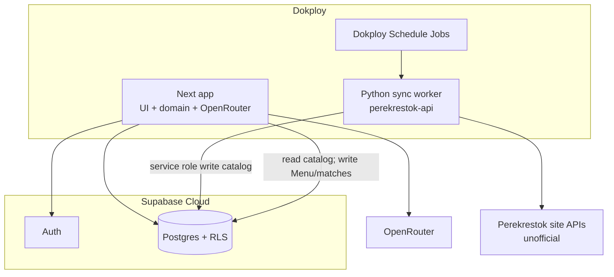
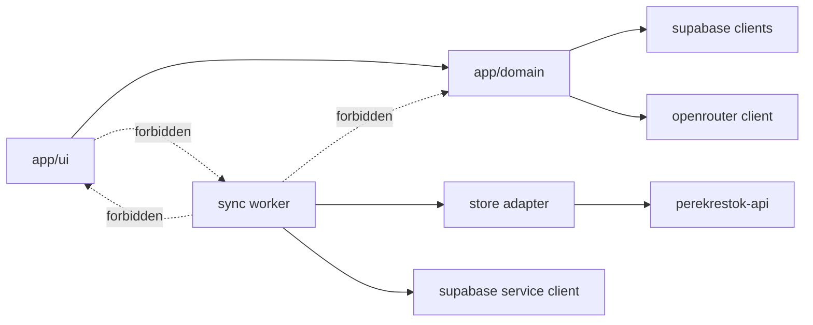
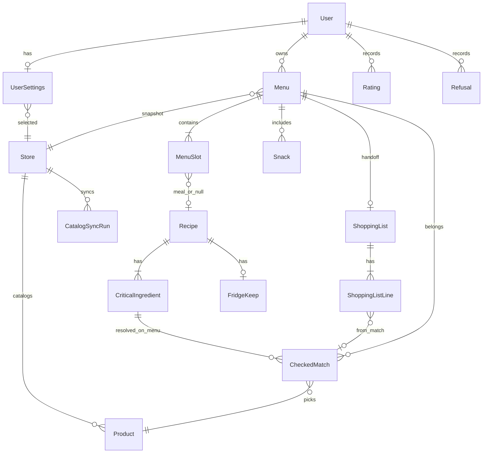

# Architecture Spine — perek-planner

## Design Paradigm

**BaaS-backed modular Next.** Domain orchestration (Menu, matching, AI suggestions, Shopping list) lives in Next server modules. Persistence and Auth live in Supabase Cloud (Postgres + RLS). Store catalog ingest is a separate Python worker on Dokploy. UI is App Router + shadcn Soft Workshop / Lavender Workshop (UX-locked): desktop, Russian, light-only.



## Invariants & Rules

### AD-1 — Runtime topology [ADOPTED]

- **Binds:** all
- **Prevents:** one epic putting DB/auth inside Next-only storage while another invents a second API/DB; catalog sync hosted on Vercel/GitHub Actions/Supabase Edge while the app is on Dokploy
- **Rule:** Deploy **Next** and the **Python catalog-sync** container on **Dokploy**. Persist data and Auth in **Supabase Cloud**. Schedule catalog sync with **Dokploy Schedule Jobs** (not GitHub Actions, not Supabase Cron for ingest). Single **prod** (+ local Next/Python against that Supabase project or a personal branch project); no required staging matrix for v1. Runtime: **Node.js ≥22** for Next.

### AD-2 — Catalog write ownership [ADOPTED]

- **Binds:** FR-16…FR-18, catalog-sync
- **Prevents:** dual writers of Products/availability; Next or Edge Functions fetching store APIs
- **Rule:** Only the Python sync worker may write catalog/availability and `catalog_sync_runs` into Supabase (service role). Next **reads** catalog for planning. Sync uses unofficial `perekrestok-api` behind a store-adapter boundary (Perekrestok only in v1 UI; other chains swap the adapter later).

### AD-3 — Matching & eligibility in Next [ADOPTED]

- **Binds:** FR-11…FR-15, FR-17, ai-suggestions
- **Prevents:** DB functions and Next both owning eligibility; ephemeral matches so Shopping list drifts
- **Rule:** Checked-match and today-stock eligibility run on the **Next server** in one matching module. AI-proposed Recipes are gated by that module before Menu assignment. See AD-7 for persistence shape and AD-10 for when eligibility re-runs.

### AD-4 — AI via OpenRouter from Next only [ADOPTED]

- **Binds:** FR-7, FR-8, FR-10, FR-12
- **Prevents:** client-side LLM calls; hardcoding a single vendor SDK; one epic ignoring Refusal/dislike while another hard-suppresses
- **Rule:** Recipe suggestions call **OpenRouter** from Next server code only. Model id is runtime config (cheap default at implement time). Secrets never ship to the browser. **Refusal** and **dislike Rating** hard-suppress that Recipe/Snack from future suggestions inside the same suggestion module (before or after LLM, but never bypassed by a second path).

### AD-5 — Auth & tenancy [ADOPTED]

- **Binds:** FR-23, personal data (Menu, Rating, history)
- **Prevents:** unauthenticated access to Menus/history; open tables without RLS
- **Rule:** Supabase Auth **email/password**. Next uses `@supabase/ssr` cookie sessions; protect planning routes with `getUser()`. RLS: user-owned rows require `auth.uid()`; catalog tables readable by authenticated users, writable only by sync service role.

### AD-6 — Dependency & contract direction [ADOPTED]

- **Binds:** all modules
- **Prevents:** Next↔sync reverse imports; hand-maintained duplicate DTOs with divergent field names
- **Rule:** Allowed deps only as in the diagram. **`supabase/migrations` is the schema SoT.** Next and sync consume that schema (generated TS types / explicit column map in sync). No parallel hand-owned Product/Menu DTOs that rename columns.



### AD-7 — CheckedMatch canonical model [ADOPTED]

- **Binds:** FR-11…FR-15, FR-17, FR-19…FR-22, AD-3
- **Prevents:** JSON match blobs on slots vs normalized tables; recipe-global match cache diverging from Menu intent
- **Rule:** `CheckedMatch` is a **normalized** table only, scoped to the **Menu** (and its assigned slot/ingredient), not a global Recipe×Store cache. Only the Next matching module inserts/replaces those rows. Shopping list **lines for matched products** reference `CheckedMatch` ids (or are derived in one handoff command from them). Staple/candidate lines may exist without a match per UX, but never invent a second product-resolution path.

### AD-8 — Catalog read & stale signal [ADOPTED]

- **Binds:** FR-16…FR-18, AD-2
- **Prevents:** sync writing `in_stock` while Next reads a different availability field; FR-18 using two competing freshness signals
- **Rule:** Column names and enums for `stores`, `products`, `catalog_sync_runs` are defined only in migrations. Availability is a single field written by sync. **FR-18 stale signal** reads the latest `catalog_sync_runs` row for the active store (not ad-hoc `products.synced_at` heuristics). When that signal is stale/failed, Next **blocks Menu planning** (domain + UI) until a fresh successful run exists for the active store.

### AD-9 — Store context ownership [ADOPTED]

- **Binds:** FR-16, Settings/store-picker (UX)
- **Prevents:** `user.selected_store_id` and `menu.store_id` both treated as live SoT for sync/matching
- **Rule:** User **Settings** hold `selected_store_id` (default: Perekrestok д. Алабино, 92). Each **Menu** snapshots `store_id` at creation; matching and Shopping list for that Menu use the snapshot. Sync refreshes catalog for the configured store(s). Changing Settings does not rewrite past Menus.

### AD-10 — Eligibility timing & Menu reuse [ADOPTED]

- **Binds:** FR-9 (post-MVP), FR-17, FR-18, AD-3, AD-7
- **Prevents:** `cloneMenu` copying stale matches while `openMenu` rewrites them incompatibly
- **Rule:** Eligibility gates **suggest** and **assign/replace slot**. Persisted `CheckedMatch` rows for a Menu are the SoT for that Menu’s handoff until a slot is replaced (then re-match that slot). **Reuse/clone Menu** copies structure/Recipes (and length/servings as draft), then **re-runs matching** — it must not copy `CheckedMatch` rows. Stale-catalog warning (AD-8) does not by itself invalidate stored matches.
- **v1 scope:** No Menu reuse/clone UI (UJ-2 / PRD FR-9 deferred). Do not implement a user-facing clone path in v1 stories. The re-match-on-reuse rule above applies only when/if a reuse story is added post-MVP.

### AD-11 — Shopping list handoff snapshot [ADOPTED]

- **Binds:** FR-13, FR-19…FR-22, AD-7, UX staples rule
- **Prevents:** one epic treating Shopping list as a live virtual view while another materializes editable rows; pantry attach diverging from UX
- **Rule:** `buildShoppingList(menuId)` **materializes** a Shopping list snapshot once for handoff: lines from that Menu’s `CheckedMatch` rows **plus** default staple/candidate lines (UX: on the list by default; no per-item pantry prompt; no in-app list edit). Copy (and optional store link) use that snapshot. Regenerating after slot/match changes replaces the snapshot; product resolution never bypasses AD-7.

## Consistency Conventions

| Concern | Convention |
| --- | --- |
| Naming (domain) | PRD glossary English ids in code (`Menu`, `Recipe`, `CheckedMatch`, `Product`, `ShoppingList`, `Snack`); RU copy in UI only |
| Naming (files) | Next App Router under `app/`; domain under `src/domain/`; supabase clients under `src/lib/supabase/`; sync under `sync/` |
| IA (UX) | Post-sign-in → Create Menu / planning; History hosts past Menus/Recipes + Rating (no separate Recipe library browse in v1); store picker in Settings |
| IDs | UUID PKs in Postgres; store external product ids as opaque strings |
| Dates | ISO-8601 UTC in DB; display Europe/Moscow in UI |
| Errors | Typed domain errors on server; RU messages at UI; stale catalog via AD-8 |
| State mutation | Menu/matches/ratings via Next server actions with user session; catalog only via sync |
| Auth | `@supabase/ssr` cookies; middleware `getUser()` |
| Config | Public Supabase URL + publishable/anon key for browser; service role, `OPENROUTER_API_KEY`, store credentials server/sync-only |
| UI system | shadcn/ui + Tailwind; Soft Workshop / Lavender Workshop; Geist Sans; light-only; desktop web |
| Handoff | Copy Shopping list always; store link optional never required (FR-20/21) |
| Non-goals in code | No in-app cart edit, stock badges, fallback flow, cook-along timers |

## Stack

| Name | Version |
| --- | --- |
| Node.js | ≥22.0.0 |
| Next.js (App Router) | 16.2.10 |
| React | 19.2.7 |
| TypeScript | 5.x (Next toolchain) |
| Tailwind CSS | 4.3.3 |
| shadcn/ui | current CLI (UX-locked) |
| @supabase/supabase-js | 2.110.7 |
| @supabase/ssr | 0.12.3 |
| Supabase Cloud | hosted Auth + Postgres + RLS |
| OpenRouter | API gateway (model id configurable) |
| perekrestok-api | 0.2.2 |
| Python (sync worker) | ≥3.10 |
| Dokploy | self-hosted PaaS + Schedule Jobs |

Starter: `create-next-app -e with-supabase`, then **upgrade Tailwind to 4.x**, align folder layout to Structural Seed, retarget deploy to Dokploy, add `sync/`.

## Structural Seed

```text
perek-planner/
  app/                 # App Router UI (RU), server actions
  src/domain/          # menu, matching, shopping, suggestions
  src/lib/supabase/   # browser + server + middleware clients
  sync/                # Python worker + store adapter
  supabase/            # migrations + RLS (schema SoT)
```



## Capability → Architecture Map

| Capability / Area | Lives in | Governed by |
| --- | --- | --- |
| Account (FR-23) | Supabase Auth + Next middleware | AD-5 |
| Settings / store picker | Next UI + `UserSettings` | AD-9, UX |
| Menu & Portion plan (FR-1…FR-5) | Next domain + Supabase | AD-1, AD-7, AD-9, AD-10 |
| Suggestions / Rating / Refusal / Recipe text (FR-6…FR-10, FR-24) | Next domain + OpenRouter + History UX | AD-3, AD-4 |
| Checked matches & eligibility (FR-11…FR-15, FR-17) | Next matching module; rows in Supabase | AD-3, AD-7, AD-10 |
| Catalog & store (FR-16…FR-18) | Python sync → Supabase; Next reads | AD-2, AD-8, AD-9 |
| Shopping list & handoff (FR-19…FR-22) | Next handoff snapshot from CheckedMatch (+ staples) | AD-7, AD-11, UX |
| UI system | Next + shadcn Soft Workshop | UX constraint |

## Deferred

| Item | Why it can wait |
| --- | --- |
| Exact OpenRouter model id | Runtime config at first AI story |
| Cheaper-analog heuristic aggressiveness | PRD OQ; tune inside matching module |
| Store-link transport format (FR-21) | Optional; copy always works |
| Second grocery chain adapter | MVP non-goal; keep adapter seam |
| Staging environment | Single prod sufficient for hobby stakes |
| Supabase Edge Functions | Not used for catalog |
| Match-review UI | Out of v1 product scope |
| Menu reuse / clone UI (UJ-2, PRD FR-9) | Deferred post-MVP; AD-10 rule reserved for when/if added |
| Elevated observability / paging | Dokploy logs + `catalog_sync_runs` enough for v1 |
| Local Supabase CLI vs cloud-only for dev | Personal preference; prod uses cloud |
| Portion defaults / fridge-keep attribute detail | Product rules in PRD; schema attributes at first Menu epic |
| AI Model-C repetition / ~2h cook heuristic | Product/voice policy in UX; implement inside suggestion module without new runtime |
