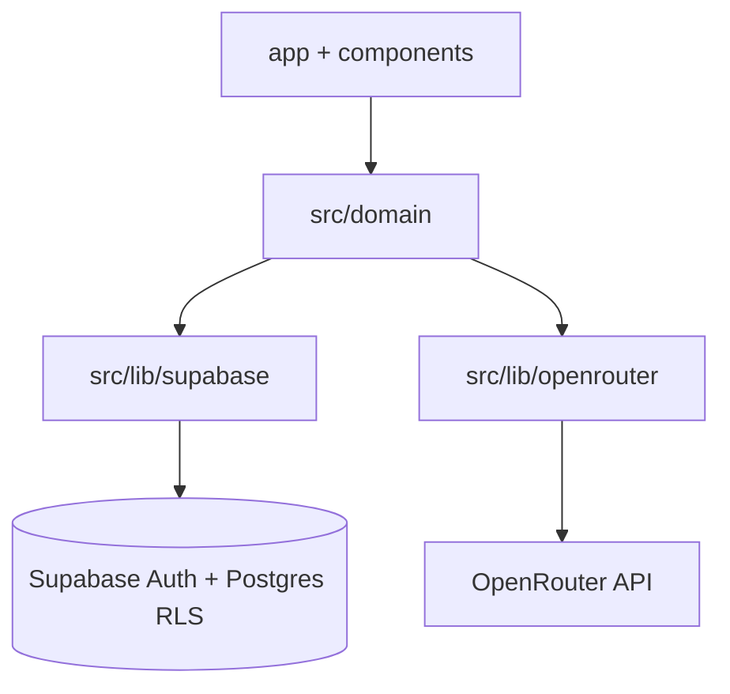

# Architecture — keplo

**Pattern:** BaaS-backed modular Next  
**Altitude:** Application (brownfield as-built)  
**Scan:** exhaustive 2026-07-20

## Executive Summary

keplo runs as a single Next.js 16 App Router application. Domain orchestration (menus, AI suggestions, shopping snapshots) lives in `src/domain/`. Persistence and Auth are Supabase Cloud (Postgres + RLS). Recipe invent/assign calls OpenRouter from **server code only**. There is no live grocery catalog and no Python sync worker in the repository.

## Technology Stack

| Layer | Choice | Version / notes |
|-------|--------|-----------------|
| Runtime | Node.js | ≥22 |
| App | Next.js App Router | 16.2.10; `proxy.ts` session |
| UI | React 19 + Tailwind 4 + shadcn | Soft Workshop, light-only, RU |
| Data | Supabase JS + SSR cookies | 2.110.7 / 0.12.3 |
| AI | OpenRouter chat completions | default `openai/gpt-4o-mini:nitro` |
| Verify | Node ESM scripts + Playwright | — |

## Dependency Direction

`app/` + `src/components/` → `src/domain/` → `src/lib/supabase|openrouter`  
Schema SoT: `supabase/migrations/`  
Do not import OpenRouter from Client Components.

## Domain Architecture

| Module | Responsibility |
|--------|----------------|
| `menu` | Skeleton RPC, load, slot/snack/portion actions, UJ-1 gate |
| `suggestions` | Invent → persist → assign; snacks; resuggest; suppress; variety |
| `shopping` | Ingredient-name snapshot (`buildShoppingList`) |
| `history` | Past menus, ratings, delete |
| `recipes` | Display/scale/format (read-only) |
| `settings` | Taste bans/wishes |
| `matching` | Fridge-keep eligibility helpers only |

### Critical invariants

1. **Invent → persist → assign** — only persisted recipe UUIDs on slots  
2. **Eligibility** — `fridge_keep_days >= menu.day_count` + hard suppress (refusal/dislike); no SKU matching  
3. **Suppress fail-closed** — query errors must not empty-suppress  
4. **UJ-1** — shopping blocked until `slot_edit_passed_at`  
5. **Create vs resuggest** — create uses deterministic assign after invent; resuggest may use OpenRouter assign  
6. **No catalog** — shopping lines are ingredient names (+ snack labels)

## Data Architecture

See [data-models.md](./data-models.md). Shared `recipes` library is writable by authenticated operators; user-owned rows use `auth.uid()` RLS.

## API Design

See [api-contracts.md](./api-contracts.md). Server Actions + RSC loaders; no REST route handlers.

## UI / State

- RSC default; client islands for forms/dialogs  
- No Redux/Zustand — server state via Supabase + `revalidatePath`  
- Plan chrome: header Create Menu CTA + `PillNav` wizard on `/plan/*`  
- See [component-inventory.md](./component-inventory.md)

## Auth

1. `proxy.ts` → `updateSession` refresh + redirect  
2. `(authenticated)/layout` defense-in-depth `getUser()`  
3. `KEPLO_DEV_BYPASS_AUTH` local-only; ignored in production  

## Testing Strategy

| Layer | Mechanism |
|-------|-----------|
| Pure domain | `scripts/verify-*-logic.mjs` → `npm run verify:logic` |
| RLS | `scripts/verify-rls-*.mjs` → `npm run verify:rls` |
| E2E | Playwright `e2e/` |
| Full gate | `npm run verify` |

## Deployment

Next on Dokploy; env for Supabase public keys + `OPENROUTER_API_KEY`. See [deployment-guide.md](./deployment-guide.md).

## Drift Warnings

- Architecture spine ER diagrams may still show Product/Store/CheckedMatch — **migrations + `src/` win**  
- README may say port 3000; `package.json` uses **3100**  
- `PortionPlanGrid` / `/plan/portions` are legacy redirects  

## Source Tree

See [source-tree-analysis.md](./source-tree-analysis.md).
